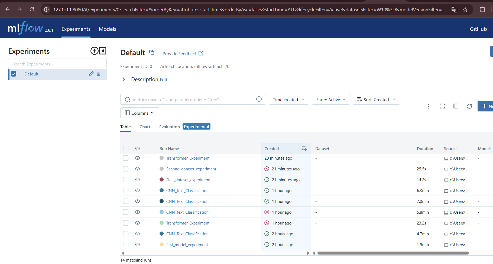
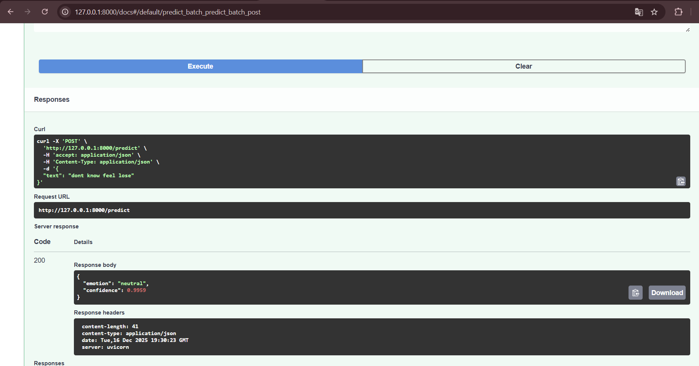
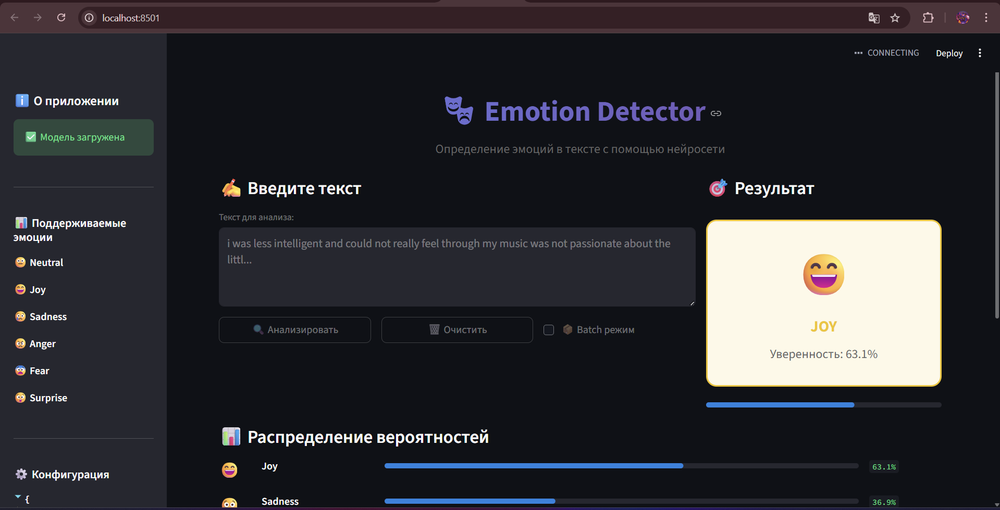

# 🎭 Emotion Classification MLOps Project

[](https://python.org)
[](https://tensorflow.org)
[](https://mlflow.org)
[](https://fastapi.tiangolo.com)
[](https://streamlit.io)

> **Курсовая работа:**
>  
> Классификация эмоций в тексте с использованием глубокого обучения и MLOps практик


---

## 🎯 О проекте

Проект представляет собой **end-to-end ML pipeline** для классификации эмоций в текстовых данных. 

### Поддерживаемые эмоции:

| Эмоция | Emoji | Описание |
|--------|-------|----------|
| Neutral | 😐 | Нейтральное состояние |
| Joy | 😄 | Радость, счастье |
| Sadness | 😢 | Грусть, печаль |
| Anger | 😠 | Злость, гнев |
| Fear | 😨 | Страх, тревога |
| Surprise | 😲 | Удивление |


---

## 📁 Структура проекта

```
MLOPS/
│
├── 📓 Курсовая_Хомякова_MLFLOW.ipynb # Jupyter notebook с экспериментами MLflow
│
├── 🎨 streamlit_ui.py # Streamlit веб-интерфейс
│
├── 📂 config/ # ⚙️ YAML конфигурации экспериментов
│ ├── cnn_experiment.yml # CNN модель
│ ├── nb_experiment.yml # Naive Bayes модель
│ ├── transformer_experiment.yml # Transformer модель
│ ├── first_dataset_experiment.yml # Конфиг первого датасета
│ └── second_dataset_experiment.yml # Конфиг второго датасета
│
├── 📂 ml_service/ # ML сервис
│ ├── 🚀 main.py # FastAPI приложение
│ └── 📂 models/ # Сохранённые модели
│ ├── cnn_model.h5 # Обученная CNN модель
│ ├── tokenizer.pickle # Токенизатор
│ └── model_config.json # Конфигурация модели
│
├── 📂 mlruns/ # MLflow артефакты и метрики
│
├── 📂 clean_mlops/ # Виртуальное окружение Python
│
├── 📄 requirements.txt # Зависимости проекта
│
└── 📄 README.md # Документация (этот файл)
```

---

## 🚀 Быстрый старт

### Клонирование и настройка

```bash
cd ~
cd Desktop
cd MLOPS_course_work_Ksusha_edition/

# Активировать (Windows Git Bash)
source clean_mlops/Scripts/activate

# Активировать (Windows CMD)
clean_mlops\Scripts\activate

# Установить зависимости
pip install -r requirements.txt
```

### Установка зависимостей

```bash
# Обновить pip
python -m pip install --upgrade pip

# Установить все зависимости
pip install -r requirements.txt
```

### requirements.txt

```txt
pandas==2.0.3
numpy==1.24.4
matplotlib==3.7.2
seaborn==0.12.2
scikit-learn==1.3.0
nltk==3.8.1
tqdm==4.66.1
joblib==1.3.2
omegaconf==2.3.0
pyyaml==6.0.1
mlflow==2.8.1
datasets==2.14.6
tensorflow==2.15.0
tf-keras==2.15.1
torch==2.0.1
transformers==4.36.2
tokenizers==0.15.0
streamlit
```

---

## 🔬 MLflow эксперименты

### Jupyter Notebook

Файл **`Курсовая_Хомякова_MLFLOW.ipynb`** содержит:

- 📊 Загрузка и анализ данных
- 🔧 Предобработка текста
- 🧠 Обучение CNN модели
- 📈 Логирование экспериментов в MLflow
- 📉 Сравнение метрик разных моделей
- 💾 Сохранение лучшей модели

### Запуск MLflow UI

```bash
mlflow server --port 8080 -- host 127.0.0.1
```




Открыть UI: **http://127.0.0.1:8080/**


---

## 🌐 API сервис

### Запуск FastAPI при помощи Dockerfile

```bash
docker build -t emotion-api .
docker run -p 8000:8000 emotion-api
```


### Endpoints

| Метод | Endpoint | Описание |
|-------|----------|----------|
| GET | `/` | Информация об API |
| GET | `/health` | Проверка состояния сервиса |
| POST | `/predict` | Предсказание для одного текста |
| POST | `/predict/batch` | Предсказание для нескольких текстов |

---

Открыть UI: **http://127.0.0.1:8000/docs**

## 🎨 Streamlit UI

### Запуск

```bash
$ source clean_mlops/Scripts/activate

$ which python
/c/Users/Smart/PycharmProjects/MLOPS_Ksusha/\Users\Smart\PycharmProjects\MLOPS_Ksusha\clean_mlops/Scripts/python
(clean_mlops)

$ pip install streamlit tensorflow numpy

$ python -m streamlit run streamlit_ui.py

  You can now view your Streamlit app in your browser.

  Local URL: http://localhost:8501
  Network URL: http://192.168.2.102:8501

```

### Возможности

- ✍️ **Ввод текста** — анализ одного текста
- 📦 **Batch режим** — анализ нескольких текстов
- 📊 **Визуализация** — графики распределения эмоций
- 🎲 **Примеры** — тестовые фразы для демонстрации
- 📈 **Статистика** — статистика по batch анализу

### Скриншоты



Открыть UI: **http://localhost:8501/**

---

